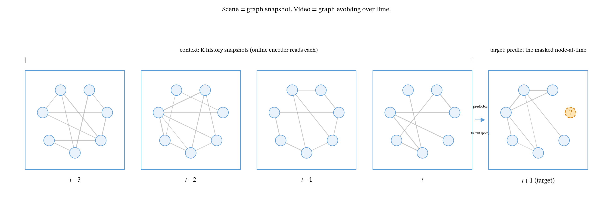
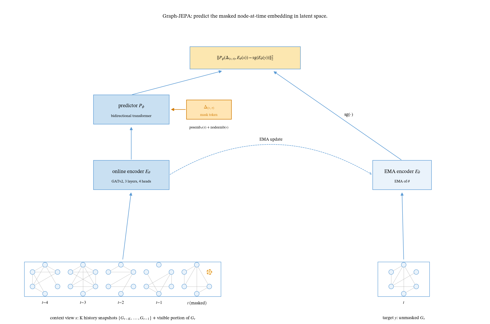

<h1 align="center">Graph-JEPA</h1>

<p align="center">
  <b>Learning the Dynamics of Relational Worlds by Observation</b>
</p>

<p align="center">
  <a href="LICENSE"></a>
  
  
</p>

<p align="center">
  <a href="https://arxiv.org/abs/2506.09985">V-JEPA 2</a> ·
  <a href="https://arxiv.org/abs/2404.08471">V-JEPA</a> ·
  <a href="https://arxiv.org/abs/2301.08243">I-JEPA</a> ·
  <a href="https://arxiv.org/abs/2410.06747">Graph-JEPA (Skenderi, static)</a> ·
  <a href="https://arxiv.org/abs/2511.08544">LeJEPA</a>
</p>

## Method

Graph-JEPA is a method for self-supervised learning of relational
temporal data. At a high level, Graph-JEPA predicts the representation
of one entity at one timestep, a *node-at-time* (v, τ), from the
representations of the rest of the temporal graph context.



Notably, this approach learns relational dynamics:

- without relying on hand-crafted graph augmentations or pre-specified
  invariances, which tend to be biased for particular downstream tasks;
- and without having the model reconstruct edge-level details (e.g.,
  bilateral flow magnitudes in a single year), which are dominated by
  reporting noise rather than signal.



## Evaluations

Action-free pretraining yields a substrate evaluated on two probe
families; planning is not addressed.

Across 8 datasets in 7 domains, two empirical signatures of learned
dynamics emerge and dissociate cleanly. Compression to ~8 effective
dimensions appears across three distinct domains; a graph-aware encoder
beats a capacity-matched non-graph ablation on next-state prediction
across three relation types. The two findings appear and disappear
independently across the matrix.

**8-dataset matrix.**

| dataset | domain | eff_rank | d≈8? | win rate | per-seed p |
|---|---|---:|:---:|---:|---|
| **BACI Gravity** | bilateral commodity trade | 7.03 | ✓ | 95.8% | <10⁻³⁰ all seeds |
| **TGBN-Trade** | country-pair trade | 7.97 | ✓ | 77.3% | <10⁻²⁶ all seeds |
| **ICIO** | sectoral input-output | 2.54 | ✗ | 98.5% | <10⁻⁷ all seeds |
| **JODIE Reddit u-u** | social co-interaction | 11.44 | ✗ | 71.7% | 10⁻⁶⁵ to 2×10⁻³ |
| JODIE Wiki u-u | wiki editing co-interaction | 3.44 | ✗ | 52.6% | 7×10⁻⁵⁹ to 0.95 |
| DBLP | academic coauthorship | 8.31 | ✓ | 38% mean | bimodal |
| Enron | corporate emails | 8.83 | ✓ | 44% | losses w/ tight CI |
| METR-LA | highway traffic | 18.28 (seq=7.07) | ✗ | 8% | p=1 all seeds |

**Per-dataset prediction advantage** (Δcos = graph − non-graph; 5 seeds,
paired Wilcoxon, Bonferroni-corrected over the 8-dataset matrix).

| dataset | Δcos (mean) | 95% CI | win rate | corrected p | Cliff's δ |
|---|---:|---|---:|---|---:|
| **BACI Gravity** | **+0.198** | [+0.177, +0.224] | 95.8% | 1.1×10⁻³⁰ | 1.00 |
| **TGBN-Trade** | **+0.084** | [+0.069, +0.103] | 77.3% | 3.8×10⁻²⁶ | 1.00 |
| **ICIO** | **+0.038** | [+0.029, +0.046] | 98.5% | 6.0×10⁻⁸ | 1.00 |
| **JODIE Reddit u-u** | **+0.105** | [+0.076, +0.130] | 71.7% | 8.3×10⁻⁶⁵ | 1.00 |
| JODIE Wiki u-u | +0.058 | [+0.041, +0.074] | 52.6% | 5.6×10⁻⁵⁸ | 1.00 |
| DBLP | −0.016 | [−0.137, +0.120] | 38.3% | 3.2×10⁻¹²⁸ | −0.20 |
| Enron | −0.046 | [−0.084, −0.006] | 38.1% | 0.92 | −0.60 |
| METR-LA | −0.004 | [−0.005, −0.003] | 7.8% | 1.0 | −1.00 |

## Pretrained models

| dataset | domain | seeds | results |
|---|---|---:|---|
| BACI Gravity | bilateral commodity trade | 5 | [`paper_results/baci_gravity/`](paper_results/baci_gravity) |
| TGBN-Trade | country-pair trade | 5 | [`paper_results/tgbn_trade/`](paper_results/tgbn_trade) |
| ICIO | sectoral input-output | 5 | [`paper_results/icio/`](paper_results/icio) |
| JODIE Reddit u-u | social co-interaction | 5 | [`paper_results/jodie_reddit_uu/`](paper_results/jodie_reddit_uu) |
| JODIE Wiki u-u | wiki editing co-interaction | 5 | [`paper_results/jodie_wikipedia_uu/`](paper_results/jodie_wikipedia_uu) |
| DBLP | academic coauthorship | 5 | [`paper_results/dblp/`](paper_results/dblp) |
| Enron | corporate emails | 5 | [`paper_results/enron/`](paper_results/enron) |
| METR-LA | highway traffic | 5 | [`paper_results/metrla/`](paper_results/metrla) |

Per-dataset, per-seed stamped outputs (`git_sha` + dataset SHA256 +
deterministic flag) live under `paper_results/`. For the full
reproduction protocol, see [REPRODUCE.md](REPRODUCE.md).

## Requirements

- Python ≥ 3.11
- PyTorch ≥ 2.3
- torch-geometric ≥ 2.4

Full dependency list in `pyproject.toml`. Install via:

```bash
pip install -e '.[experiments,dev]'
```

## License

See the [LICENSE](LICENSE) file for details.

## Citation

```bibtex
@misc{bodnar2026graphjepa,
  title  = {Graph-JEPA: Learning the Dynamics of Relational Worlds
            by Observation},
  author = {Bodnar, Sofia},
  year   = {2026},
  note   = {Graph-JEPA-2 codebase}
}
```
