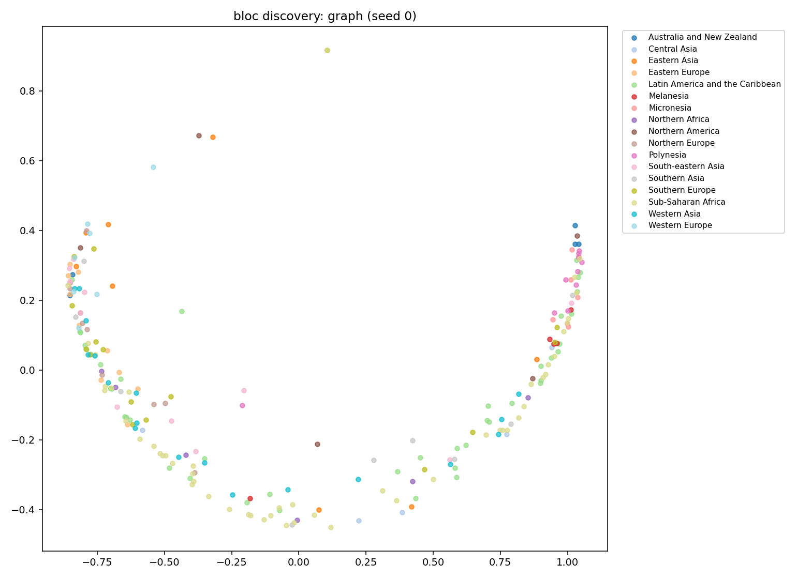
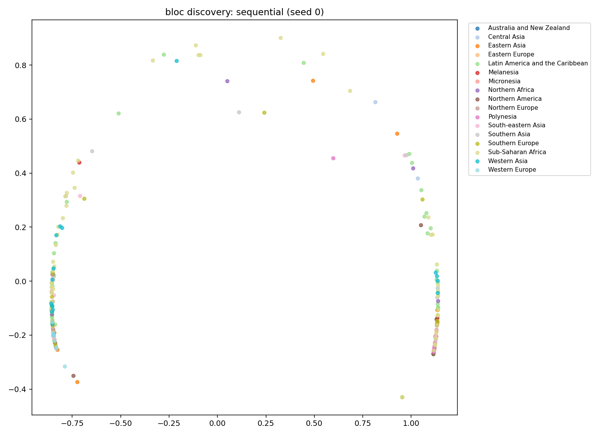
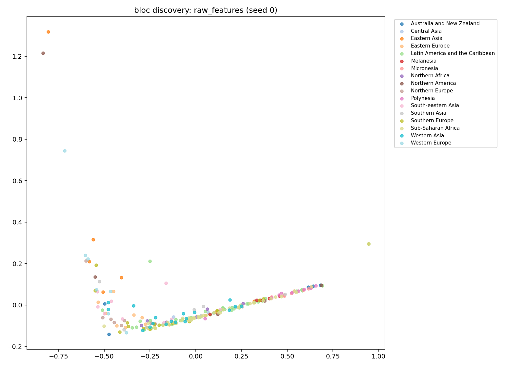

# bloc discovery analysis: baci_gravity

## aggregate metrics (median across seeds)

| condition | ARI | NMI | purity |
|---|---:|---:|---:|
| graph | 0.032 | 0.291 | 0.322 |
| sequential | 0.024 | 0.283 | 0.295 |
| raw_features | 0.039 | 0.290 | 0.330 |

**ARI gap (graph − sequential): +0.008** (headline metric: > +0.2 = clear bloc-discovery win)
**ARI gap (graph − raw features): -0.007**

## per-bloc purity (median across seeds)

how many of each bloc's members end up in the same cluster?
a value of 1.0 means the model recovered that bloc perfectly.

| bloc | graph | sequential | raw features |
|---|---:|---:|---:|
| ASEAN | 0.40 | 0.50 | 0.40 |
| BRICS | 0.40 | 0.80 | 0.60 |
| EAEU | 0.40 | 0.20 | 0.40 |
| EU27 | 0.37 | 0.67 | 0.33 |
| G7 | 0.71 | 0.71 | 0.71 |
| GCC | 0.33 | 0.33 | 0.33 |
| MERCOSUR | 0.40 | 0.40 | 0.20 |
| USMCA | 0.33 | 0.67 | 0.33 |

## cluster × region confusion matrix (seed 0, graph)

| cluster | Sub-Saharan Africa | Latin America and  | Western Asia | Southern Europe | South-eastern Asia | Polynesia | Eastern Europe | Northern Europe | Southern Asia | Eastern Asia | Western Europe | Micronesia | Northern Africa | Australia and New  | Northern America | Melanesia | Central Asia | | total |
|---|---|---|---|---|---|---|---|---|---|---|---|---|---|---|---|---|---|---|
| 0 | 1 | 3 | 3 | 1 | 4 | 0 | 4 | 5 | 1 | 0 | 2 | 0 | 0 | 2 | 0 | 0 | 0 | 26 |
| 1 | 6 | 8 | 1 | 2 | 0 | 2 | 0 | 0 | 0 | 1 | 0 | 2 | 0 | 0 | 0 | 3 | 1 | 26 |
| 2 | 6 | 2 | 0 | 0 | 0 | 0 | 0 | 0 | 0 | 1 | 0 | 0 | 0 | 0 | 0 | 1 | 1 | 11 |
| 3 | 3 | 3 | 2 | 3 | 0 | 0 | 3 | 1 | 1 | 0 | 0 | 0 | 2 | 0 | 0 | 0 | 0 | 18 |
| 4 | 5 | 1 | 2 | 0 | 0 | 0 | 0 | 0 | 1 | 0 | 0 | 0 | 1 | 0 | 0 | 0 | 0 | 10 |
| 5 | 1 | 1 | 0 | 1 | 0 | 0 | 0 | 0 | 0 | 0 | 0 | 0 | 0 | 0 | 0 | 0 | 0 | 3 |
| 6 | 3 | 6 | 2 | 2 | 1 | 0 | 2 | 0 | 0 | 0 | 0 | 0 | 0 | 0 | 0 | 0 | 0 | 16 |
| 7 | 5 | 1 | 2 | 0 | 0 | 0 | 0 | 0 | 1 | 0 | 0 | 0 | 1 | 0 | 1 | 0 | 1 | 12 |
| 8 | 2 | 7 | 1 | 2 | 1 | 0 | 0 | 0 | 3 | 0 | 0 | 0 | 1 | 0 | 0 | 0 | 0 | 17 |
| 9 | 5 | 4 | 0 | 0 | 1 | 7 | 0 | 0 | 1 | 0 | 0 | 5 | 0 | 3 | 1 | 1 | 0 | 28 |
| 10 | 0 | 0 | 0 | 0 | 0 | 0 | 0 | 0 | 0 | 1 | 1 | 0 | 0 | 0 | 1 | 0 | 0 | 3 |
| 11 | 6 | 3 | 1 | 1 | 1 | 0 | 0 | 3 | 0 | 0 | 0 | 0 | 1 | 0 | 0 | 0 | 0 | 16 |
| 12 | 2 | 3 | 1 | 0 | 0 | 0 | 0 | 0 | 0 | 1 | 0 | 0 | 0 | 0 | 0 | 0 | 1 | 8 |
| 13 | 0 | 0 | 0 | 1 | 1 | 1 | 0 | 0 | 0 | 0 | 0 | 0 | 0 | 0 | 1 | 0 | 0 | 4 |
| 14 | 0 | 0 | 0 | 2 | 1 | 0 | 1 | 1 | 1 | 4 | 4 | 0 | 0 | 0 | 1 | 0 | 0 | 15 |
| 15 | 0 | 1 | 0 | 0 | 1 | 0 | 0 | 0 | 0 | 0 | 0 | 0 | 0 | 0 | 0 | 0 | 0 | 2 |
| 16 | 6 | 1 | 3 | 1 | 0 | 0 | 0 | 0 | 0 | 0 | 0 | 0 | 0 | 0 | 0 | 0 | 1 | 12 |
| total | 51 | 44 | 18 | 16 | 11 | 10 | 10 | 10 | 9 | 8 | 7 | 7 | 6 | 5 | 5 | 5 | 5 | 227 |

## visualizations

-  — UMAP/PCA projection colored by UN M49 subregion
-  — UMAP/PCA projection colored by UN M49 subregion
-  — UMAP/PCA projection colored by UN M49 subregion
